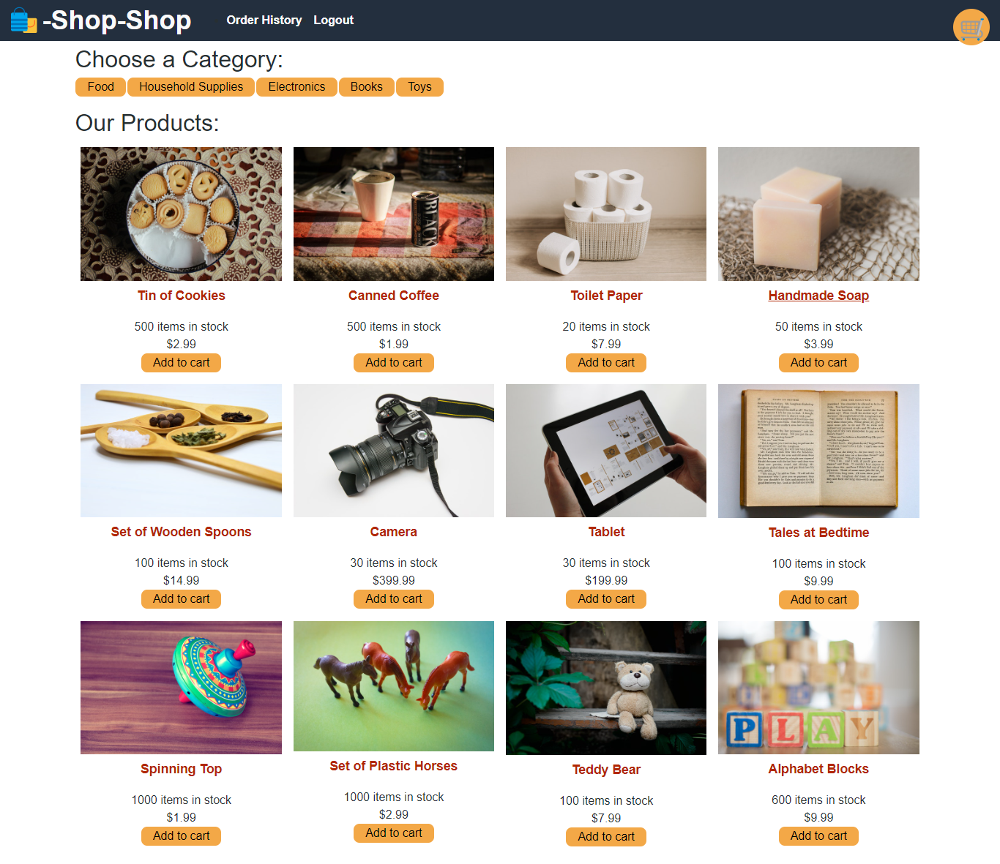

# Shop Shop

## Table of Contents
* [Description](#description)
* [Technologies Used](#technologies-used)
* [Installation](#installation)
* [Usage](#usage)
* [Contributing](#contributing)
* [Images](#images)
* [Deployed URL](#deployed-url)
* [Questions](#questions)

### Description
This project take the e-commerce platform replaces its implementation to handle complex state management using Redux, the open-source JavaScript library that it emulates.

### Technologies Used
* MongoDB
* Express
* React
* Node.js
* JavaScript
* GraphQL
* Redux

### Installation
1. Clone repository using `git clone git@github.com:ajmarrocco/shop-shop.git`
2. Type `npm i` or `npm install` to install all dependencies
3. Type `npm start` or `node server` to start database

### Usage 
All dependencies must be installed prior to using application

### Contributing 
Pull requests are reviewed

### Images

### Deployed URL
https://shop-and-redux.herokuapp.com/

### Questions
If you have any questions about opening an issue or the repository itself, please contact me at ajmarrocco@gmail.com. Please visit https://github.com/ajmarrocco for more of my projects!